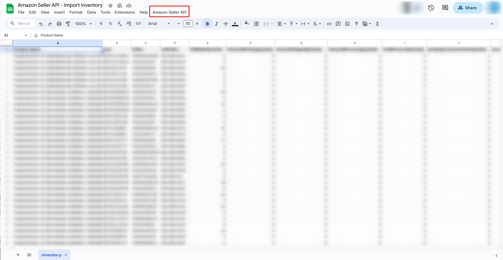

# Amazon Seller API Integration with Google Apps Script

This repository contains a Google Apps Script project for fetching Amazon Seller API data and inserting it into a Google Sheets spreadsheet. The script allows you to fetch inventory data from the Amazon Seller API and organize it in a specified format in your Google Sheet.

## Setup and Configuration

1. Create a Google Sheets document where you want to insert the Amazon Seller API data. Make sure to set up the appropriate columns.

2. Open the Google Sheets document and click on `Extensions` > `Apps Script`.

3. Copy and paste the contents of `Code.gs` into the Google Apps Script editor.

4. Configure the following variables in the script:

   - `apiUrl`: The URL of the Amazon Seller API.
   - `refreshToken`: Your Amazon Seller API refresh token.
   - `clientId`: Your Amazon Seller API client ID.
   - `clientSecret`: Your Amazon Seller API client secret.

5. Save your script, and you're ready to use it.

## Usage

1. In your Google Sheets document, click on the custom menu option "Amazon Seller API" that you've created.

2. Select "Fetch Inventory" to fetch inventory data from the Amazon Seller API.

3. The script will make a request to the Amazon Seller API and insert the data into the Google Sheet based on the specified column order.

## Script Functions

- `onOpen(e)`: Sets up a custom menu in Google Sheets for easy access to the script functions.

- `fetchInventory()`: Fetches inventory data from the Amazon Seller API and inserts it into the Google Sheet.

- `getAuthenticationToken()`: Retrieves an access token from Amazon Seller API using the provided refresh token.

- `showAlert(args)`: Displays a pop-up alert message in Google Sheets.

- `insertData(data)`: Inserts data into the Google Sheet in the specified column order.

- `organizeData(data)`: Organizes the fetched data in the required format.

## Customizing the Column Order

You can customize the column order by modifying the `columns` array in the script. Ensure that the column order in the array matches the column order in your Google Sheet.

## Handling Zero Values

The script has been updated to display '0' instead of an empty string when any value is 0 in the fetched data.

## Contributors

Thank you to the following contributors for their valuable contributions to this project:

- Arifur Rahman Arif

  - 
  - 
  - [https://www.websider.co.uk/](#) - 
